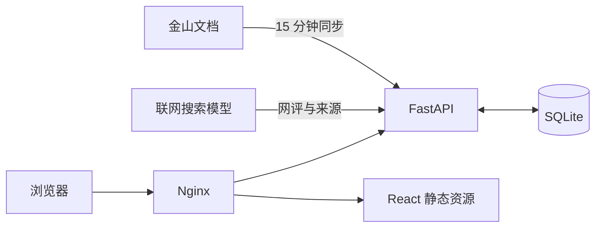

# 大潘的就业情报站：技术细节

## 1. 项目概览

这是一个校园招聘与宣讲会信息展示站。系统每 15 分钟读取一次公开的金山文档，将数据整理后提供检索、筛选、详情展示和后台管理；同时可调用带联网搜索能力的大模型生成企业网评摘要、推荐参考分和来源链接。



## 2. 技术栈

- 前端：React、Vite、Ant Design、Ant Design Icons
- 后端：Python 3.13、FastAPI、Uvicorn
- 数据库：SQLite，启用 WAL 模式
- 部署：Docker Compose、Nginx
- 外部数据：金山文档公开查看接口
- 网评分析：OpenAI Responses 兼容接口，当前模型为 `gpt-5.6-luna`

主要目录：

```text
backend/app.py       API、同步任务、后台管理、网评队列
backend/recording.py 百炼文件转写、长文本分段与总结
backend/source.py    金山文档数据抓取与字段标准化
backend/review.py    联网搜索、模型调用、来源解析与评分校验
frontend/src/        React 页面和样式
data/jobs.sqlite3    运行数据（不纳入 Git）
tests/test_app.py    后端回归测试
```

## 3. 数据同步

FastAPI 启动后运行后台线程，每 900 秒检查“招聘信息”和“宣讲会信息”两个工作表。同步成功后在事务中更新 SQLite；同步失败时保留上一版数据，因此上游表格暂时不可用不会清空网站。

管理员对记录的编辑保存在 `overrides` 表，不会写回金山文档。后续同步只更新原始字段，人工覆盖字段继续生效。招聘截止状态和宣讲会状态由后端按北京时间动态计算。

## 4. 网评分析

网评任务存储在 `company_reviews` 表，由单线程队列依次处理，避免并发请求造成费用和限流问题。模型通过 `web_search` 搜索企业相关的求职与工作体验信息，优先整理 5–10 个来源，并返回：

- 0–100 推荐参考分及分档标签
- 综合摘要、常见正面反馈和常见顾虑
- 可点击的来源标题与 URL
- 输入、输出、总 Token 和搜索次数

来源同时兼容 Responses API 的 `action.url`、`action.sources`、文本引用和结构化结果。后端会校验 URL、分数和 JSON 格式后才保存结果。单家公司失败会记录原因和用量，然后继续下一家公司。

批量补齐默认只处理没有推荐结果的企业。仅存在于已结束宣讲会中的企业不会进入分析列表；如果企业还有招聘岗位或未结束宣讲，则仍可分析。

API 密钥只保存在服务器 `/opt/job-board/.env`，不写入数据库、前端文件或 Git。

### 宣讲会录音处理

`event_recordings` 表以宣讲会记录 ID 为唯一键，保存文件元数据、处理状态、转写、总结和公开开关。音频本体使用随机文件名保存在 `/app/data/recordings`，只能通过管理员接口下载。上传接口采用流式写盘并独立限制为 500 MB，其他写接口仍保持较小的请求限制。

管理员启动处理后，后台单队列生成 24 小时有效的高熵临时取件 URL，提交给 `qwen-audio-3.0-asr-flash-filetrans` 并轮询异步任务。转写完成后立即注销取件令牌。长转写按语义边界分段提取事实，再由 `gpt-5.6-luna` 合并成全文总结；提示词要求保留招聘关键信息、过滤无关声音，并如实标注录音缺失与听不清内容。公开 API 只在管理员开启公开开关后返回总结，永不返回录音路径、临时令牌或原始转写。

## 5. 后台与安全

管理后台支持记录增删改、隐藏、置顶、数据同步、网评队列、站点设置和密码修改。管理员密码使用 scrypt 哈希保存；会话 Cookie 使用 HttpOnly、SameSite，HTTPS 入口额外启用 Secure。后台写请求校验来源与自定义请求头，登录接口在应用层和 Nginx 层均有限流。

后台可启用或暂停 PushPlus。每次同步只比较新增宣讲会，推送内容仅包含企业名称和时间；Token 通过服务器 `.env` 的 `PUSHPLUS_TOKEN` 注入，管理页面只显示配置状态、最近结果并支持发送测试消息。

登录页可在私人固定设备上保存管理员账号和密码。该信息仅保存在当前浏览器的本地存储中，取消勾选或成功修改管理员密码后会清除。

容器以非 root 用户运行，根文件系统只读，仅挂载 `data` 目录用于持久化。应用只监听服务器本机的 `127.0.0.1:18080`，由 Nginx 对外提供服务。

## 6. 部署与访问

服务器项目目录为 `/opt/job-board`，访问入口为：

- 域名：`https://example.com/`
- IP 备用入口：`http://YOUR_SERVER_IP/`

请求链路为 Cloudflare → Nginx → Docker 内的 FastAPI。IP 入口独立保留，不强制跳转到域名。

常用运维命令：

```bash
cd /opt/job-board
docker compose up -d --build
docker compose ps
docker compose logs --tail=100 app
curl -fsS http://127.0.0.1:18080/api/health
```

前端构建与后端测试：

```bash
cd /opt/job-board/frontend
npm run build

cd /opt/job-board
.venv/bin/pytest tests -q
```

SQLite 每日生成一致性备份并保留最近 14 份，备份目录为 `/opt/job-board/backups`。

## 7. 维护注意事项

- 保持 Uvicorn 单 worker，否则会重复启动同步和网评后台线程。
- 不要将 `.env`、`data`、`backups` 或管理员凭据提交到 Git。
- 更新模型接口后，应先对单家公司验证来源链接和 Token 用量，再提交批量任务。
- 金山文档表头、分享权限或公开接口发生变化时，优先检查 `backend/source.py`。
- 修改后至少运行后端测试、前端构建和 `/api/health` 健康检查。
